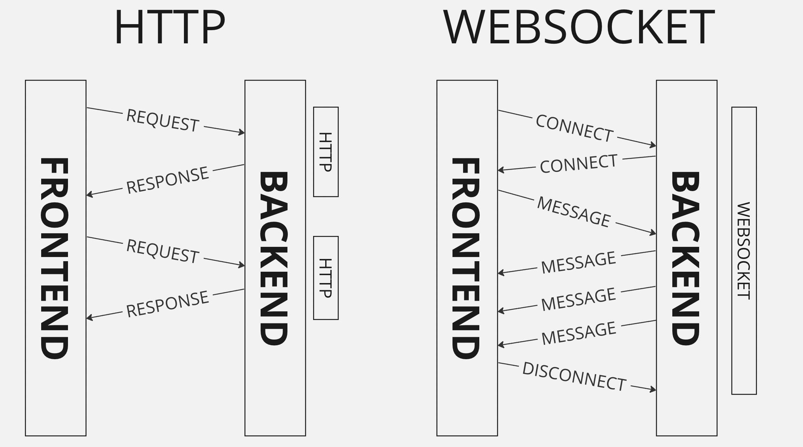

# Websocket и HTTP

**WebSocket** - это протокол, позволяющий установить постоянное соединение между клиентом и сервером, 
которое может быть использовано для обмена двусторонними потоками данных в режиме реального времени.

WebSocket работает поверх протокола HTTP и устанавливает одно соединение, 
которое может быть использовано для множества запросов и ответов между клиентом и сервером.

## Преимущества WebSocket:

- **Реальное время**: WebSocket обеспечивает более низкую задержку и более высокую производительность в режиме реального времени, чем HTTP, поскольку данные могут быть переданы в обоих направлениях без необходимости установки нового соединения.
- **Эффективность**: WebSocket использует меньше ресурсов, чем HTTP, потому что устанавливается только одно соединение между клиентом и сервером.

## Недостатки WebSocket:

- **Сложность**: WebSocket является более сложным для реализации, чем HTTP, особенно на стороне сервера.
- **Совместимость**: Некоторые старые браузеры и прокси-серверы могут не поддерживать WebSocket.
- **Постоянное подключение**: WebSocket использует постоянное соединение между клиентом и сервером, что может привести к проблемам с масштабированием, если на сервере имеется большое количество подключений.

## Демонстрация работы


## Запуск кода
```
yarn
yarn lerna run dev
```
